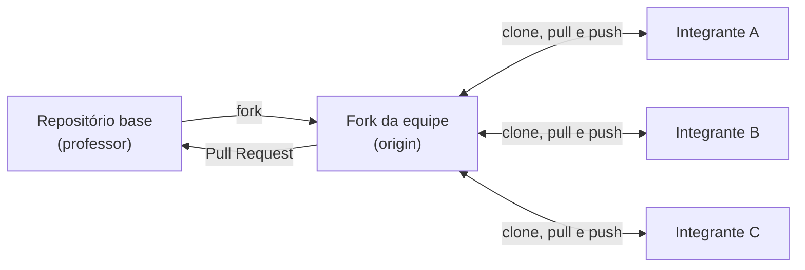

# 🧮 Calculadora de Média

Repositório base da avaliação prática de **Engenharia de Software II**.

O projeto é propositalmente simples: um programa de linha de comando que calcula a média das notas
de um aluno e informa a sua situação. **O objetivo da avaliação não é programar algo difícil**, e sim
demonstrar o **fluxo completo de trabalho em equipe com Git**: fork, branches, commits no padrão
Conventional Commits, merges, resolução de conflitos, versionamento e Pull Request.

> [!IMPORTANT]
> Não trabalhe diretamente neste repositório. A equipe deve **fazer um fork** e trabalhar nele.

## 👥 Equipe

> Preenchida pela equipe na [TAREFA-01](TAREFAS.md#tarefa-01--integrantes-da-equipe).

**Nome da equipe:**

| Nome | Usuário do GitHub |
| Eduardo Perleberg Heckler | eduardosenac25 |

## Sumário

- [Sobre o projeto](#sobre-o-projeto)
- [O que a equipe deve fazer](#o-que-a-equipe-deve-fazer)
- [Passo a passo](#passo-a-passo)
- [Tarefas](#tarefas)
- [Regras](#regras)
- [Como vocês serão avaliados](#como-vocês-serão-avaliados)
- [Entrega](#entrega)
- [Dúvidas frequentes](#dúvidas-frequentes)

---

## Sobre o projeto

### Regras de avaliação

| Média                 | Situação    |
| --------------------- | ----------- |
| maior ou igual a 7,0  | Aprovado    |
| de 5,0 a menos de 7,0 | Recuperação |
| menor que 5,0         | Reprovado   |

As notas vão de 0 a 10. Os valores de corte ficam em [`src/config.js`](src/config.js).

### Como usar

Requisitos: [Node.js](https://nodejs.org/) 20 ou superior. Não há dependências para instalar.

```bash
npm start -- 6 8 9
```

```
Média: 7.666666666666667
Situação: Aprovado
```

### Como testar

```bash
npm test
```

### Estrutura

```
.
├── .github/
│   ├── scripts/validar-commits.js   # Verificação de Conventional Commits
│   ├── workflows/ci.yml             # Integração contínua (testes + commits)
│   └── pull_request_template.md     # Modelo do Pull Request de entrega
├── src/
│   ├── config.js                    # Notas e médias de corte
│   ├── index.js                     # Programa de linha de comando
│   └── media.js                     # Cálculo da média e da situação
├── tests/
│   └── media.test.js                # Testes automatizados
├── CHANGELOG.md                     # Histórico de versões
├── CONTRIBUTING.md                  # Padrão de trabalho com Git
├── README.md
└── TAREFAS.md                       # Descrição das tarefas da avaliação
```

---

## O que a equipe deve fazer



1. Um integrante faz o **fork** e adiciona os colegas como **colaboradores**.
2. Cada integrante **clona o fork** no seu computador.
3. A equipe **divide as tarefas** descritas em [TAREFAS.md](TAREFAS.md).
4. Cada tarefa é feita em **uma branch**, com **commits no padrão Conventional Commits**.
5. Cada integrante faz o **merge `--no-ff`** da sua branch na `main` local, resolve os conflitos e envia a `main` para o fork.
6. Com tudo pronto, a equipe publica a versão **1.1.0** e abre **um Pull Request** para este repositório.

---

## Passo a passo

### 1. Fork e colaboradores (um integrante)

1. Clique em **Fork** → **Create fork** no topo desta página.
2. No fork, abra **Settings** → **Collaborators** → **Add people** e convide os colegas. Cada colega precisa **aceitar o convite** (chega por e-mail).
3. No fork, abra a aba **Actions** e clique em **"I understand my workflows, go ahead and enable them"**.

### 2. Clone e configuração (cada integrante)

```bash
git clone https://github.com/<usuario-que-fez-o-fork>/repo-aval-2026.git
cd repo-aval-2026

git config user.name "Seu Nome Completo"
git config user.email "e-mail-da-sua-conta@github.com"
git config pull.rebase false

git remote add upstream https://github.com/wagnerloch/repo-aval-2026.git

npm test
```

> ⚠️ O e-mail precisa ser o **mesmo da sua conta do GitHub**; é por ele que o professor identifica quem fez cada commit.

### 3. Divisão das tarefas (equipe)

Leiam o [TAREFAS.md](TAREFAS.md) e o [CONTRIBUTING.md](CONTRIBUTING.md), rodem `git log --oneline --graph`
para conhecer o padrão do repositório e decidam quem faz cada tarefa.

### 4. Desenvolvimento de cada tarefa (cada integrante)

```bash
git switch main
git pull origin main
git switch -c <tipo>/tarefa-XX-descricao-curta

# ... faça a alteração e rode: npm test

git status
git add <arquivos alterados>
git commit -m "<tipo>(escopo): descrição"
git push -u origin <tipo>/tarefa-XX-descricao-curta
```

### 5. Merge na `main` (cada integrante, para a própria branch)

```bash
git switch main
git pull origin main
git merge --no-ff <tipo>/tarefa-XX-descricao-curta
# havendo conflito: resolva, rode npm test, git add e git commit

npm test
git push origin main
```

Se o `push` for **rejeitado**, um colega enviou algo antes de você: rode `git pull origin main`, resolva
eventuais conflitos, rode os testes e tente o `push` de novo. **Nunca use `--force`.**

### 6. Versão 1.1.0 (um integrante, por último)

Siga a [TAREFA-07](TAREFAS.md#tarefa-07--versão-110): atualizar `CHANGELOG.md` e `package.json`, fazer
o merge e criar a tag `v1.1.0`.

### 7. Pull Request (um integrante)

1. No fork, clique em **Contribute** → **Open pull request**.
2. Confira a direção: `wagnerloch/repo-aval-2026` **main** ← `<usuario-que-fez-o-fork>/repo-aval-2026` **main**.
3. Título: **`Entrega: <Nome da equipe>`**.
4. Preencha **todo** o modelo que aparece na descrição.
5. Clique em **Create pull request**.

> [!NOTE]
> O Pull Request **não será mergeado**: ele é a entrega e será fechado após a avaliação.
> As verificações do CI podem aguardar a aprovação do professor para começar a rodar.

---

## Tarefas

Descrição completa e critérios de aceite em **[TAREFAS.md](TAREFAS.md)**.

| Tarefa    | Resumo                                                  | Quem faz                    |
| --------- | ------------------------------------------------------- | --------------------------- |
| TAREFA-01 | Adicionar seu nome na seção **Equipe** deste README     | **Cada** integrante         |
| TAREFA-02 | Corrigir a situação de quem tem média exatamente 7,0    | Um integrante               |
| TAREFA-03 | Escrever testes para notas inválidas                    | Um integrante               |
| TAREFA-04 | Reescrever o cálculo da média sem o laço `for`          | Um integrante               |
| TAREFA-05 | Exibir a média com uma casa decimal                     | Um integrante               |
| TAREFA-06 | Criar a situação "Aprovado com distinção"               | Um integrante               |
| TAREFA-07 | Publicar a versão 1.1.0 (CHANGELOG, versão e tag)       | Um integrante, por último   |

Cada integrante deve ser responsável pela sua TAREFA-01 **e** por pelo menos uma das tarefas 02 a 07.

---

## Regras

1. Equipes de **2 a 4 integrantes**, todos colaboradores do mesmo fork.
2. **Uma branch por tarefa** (na TAREFA-01, uma por integrante), no formato `<tipo>/tarefa-XX-descricao-curta`.
3. **Nenhum commit de desenvolvimento diretamente na `main`**: nela só entram commits de merge.
4. Merges na `main` com **`git merge --no-ff`**, mantendo a mensagem padrão.
5. Commits no padrão **[Conventional Commits](https://www.conventionalcommits.org/pt-br/v1.0.0/)**, escritos pelos próprios integrantes.
6. **Nunca** usar `git push --force` na `main` nem reescrever commits já enviados.

Os detalhes estão no [guia de contribuição](CONTRIBUTING.md).

---

## Como vocês serão avaliados

O foco é o **processo**. A avaliação analisa o **histórico do fork** (`git log --graph`), as **branches**,
os **commits de cada integrante**, a **tag** e o **Pull Request**. Total: **100 pontos**.

### 1. Fork e trabalho em equipe — 15 pontos

| Item                                                                              | Pontos |
| --------------------------------------------------------------------------------- | :----: |
| Fork criado a partir deste repositório, com os integrantes como colaboradores     | 5      |
| Todos os integrantes são autores de commits (nome e e-mail identificáveis)        | 10     |

### 2. Branches — 20 pontos

| Item                                                                              | Pontos |
| --------------------------------------------------------------------------------- | :----: |
| Uma branch por tarefa (e uma por integrante na TAREFA-01)                         | 8      |
| Nomes no formato `<tipo>/tarefa-XX-descricao-curta`                               | 4      |
| Nenhum commit de desenvolvimento feito diretamente na `main`                      | 8      |

### 3. Merges e conflitos — 20 pontos

| Item                                                                              | Pontos |
| --------------------------------------------------------------------------------- | :----: |
| Merges com `--no-ff`, deixando as branches visíveis no histórico                  | 10     |
| Conflitos resolvidos sem marcadores esquecidos e sem perder o trabalho dos colegas | 10    |

### 4. Conventional Commits — 20 pontos

| Item                                                                              | Pontos |
| --------------------------------------------------------------------------------- | :----: |
| Mensagens no formato do padrão                                                    | 10     |
| Tipo adequado a cada mudança (`feat`, `fix`, `test`, `refactor`, `docs`, `chore`…) | 6     |
| Commits pequenos, com descrições claras                                           | 4      |

Commits fora do padrão **não impedem a entrega**, mas descontam pontos. O CI do Pull Request mostra quais
commits estão fora do padrão; **não reescrevam** commits já enviados para tentar corrigi-los.

### 5. Tarefas — 15 pontos

| Item                                                                              | Pontos |
| --------------------------------------------------------------------------------- | :----: |
| TAREFA-01: todos os integrantes listados, cada um pelo próprio commit             | 3      |
| TAREFA-02 a TAREFA-07 atendendo aos critérios de aceite (2 pontos cada)           | 12     |

### 6. Pull Request e versão — 10 pontos

| Item                                                                              | Pontos |
| --------------------------------------------------------------------------------- | :----: |
| Pull Request com o título no padrão e o modelo completamente preenchido           | 5      |
| Tag `v1.1.0` publicada no fork                                                    | 2      |
| Testes passando no CI                                                             | 3      |

### Observações

- A nota é da equipe. Integrantes **sem commits próprios** no histórico terão a nota avaliada individualmente.
- `git push --force` que apague commits de colegas: **−10 pontos**.
- Qualquer integrante pode ser chamado a **explicar** um commit, uma branch, um merge ou a resolução de um conflito da equipe.

---

## Entrega

| Item             | Definição                                                            |
| ---------------- | -------------------------------------------------------------------- |
| **Formato**      | Pull Request da `main` do fork para a `main` deste repositório       |
| **Título**       | `Entrega: <Nome da equipe>`                                          |
| **Prazo**        | Conforme divulgado pelo professor no ambiente virtual da disciplina  |

- Commits enviados **após o prazo** não serão considerados.
- Não apaguem os repositórios do fork até a divulgação das notas.

---

## Dúvidas frequentes

<details>
<summary><strong>Meu colega não consegue fazer push no fork.</strong></summary>

Ele precisa ser adicionado em **Settings → Collaborators** do fork **e aceitar o convite** recebido por e-mail.
</details>

<details>
<summary><strong>O push da <code>main</code> foi rejeitado (<code>rejected</code> / <code>fetch first</code>).</strong></summary>

Um colega enviou commits antes de você. Rode `git pull origin main`, resolva os conflitos (se houver),
rode `npm test` e faça o `push` novamente. Veja [Push rejeitado](CONTRIBUTING.md#push-rejeitado).
</details>

<details>
<summary><strong>Apareceu <code>fatal: Need to specify how to reconcile divergent branches</code>.</strong></summary>

Rode `git config pull.rebase false` e repita o `git pull origin main`.
</details>

<details>
<summary><strong>Deu conflito no merge.</strong></summary>

É esperado. Siga [Resolvendo conflitos](CONTRIBUTING.md#resolvendo-conflitos) e descreva no Pull Request
como a equipe resolveu.
</details>

<details>
<summary><strong>Escrevi a mensagem do commit errada.</strong></summary>

Se ainda **não** fez `push`: `git commit --amend -m "tipo(escopo): mensagem correta"`.
Se já fez `push`: não reescreva; siga em frente e comente no Pull Request.
</details>

<details>
<summary><strong>Fiz um commit direto na <code>main</code> por engano.</strong></summary>

Se ainda não fez `push`, mova o commit para uma branch (veja [Correções comuns](CONTRIBUTING.md#correções-comuns)).
Se já fez `push`, não reescreva a `main`: explique a situação no Pull Request.
</details>

<details>
<summary><strong>Meus commits aparecem com outro nome ou sem foto no GitHub.</strong></summary>

Confira `git config user.name` e `git config user.email`. O e-mail deve ser o mesmo cadastrado na sua conta do GitHub.
</details>

<details>
<summary><strong>O CI não roda no fork.</strong></summary>

Em forks, o GitHub Actions começa desativado. Abra a aba **Actions** do fork e ative os workflows.
</details>
